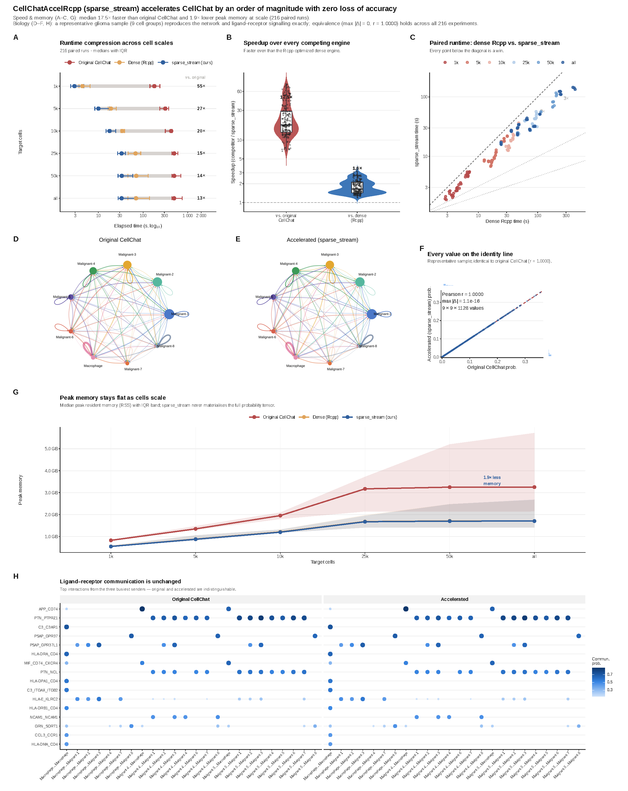

# CellChatAccelRcpp

[](https://doi.org/10.5281/zenodo.21294476)
[](https://www.gnu.org/licenses/gpl-3.0.en.html)
[](DESCRIPTION)

CellChatAccelRcpp is a 64-bit `sparse_stream` R/Rcpp acceleration layer for large-scale CellChat RNA workflows. It keeps the standard CellChat object interface and replaces selected computational bottlenecks with compiled routines for communication probability estimation, pathway aggregation, network aggregation and group-level expression summaries.

The package is intended for users who need to run many CellChat analyses, larger cell sets or high-resolution groupings while preserving outputs that remain directly comparable with the original CellChat workflow.

Current public release: `v0.1.3`, the 64-bit `sparse_stream` release.

## What Is Accelerated

CellChatAccelRcpp provides accelerated replacements for the main single-dataset RNA workflow steps:

- `computeAveExprAccelRcpp()`: group-level `triMean` expression summaries
- `computeCommunProbAccelRcpp()`: ligand-receptor communication probability inference
- `computeCommunProbPathwayAccelRcpp()`: pathway-level aggregation
- `aggregateNetAccelRcpp()`: network aggregation

The public workflow starts from the 64-bit `sparse_stream` kernel. Other kernels are retained for developer checks and equivalence testing, but the default user path is:

```r
computeCommunProbAccelRcpp(
  cellchat,
  nboot = 100,
  seed.use = 1L
)
```

The accelerated code preserves the CellChat probability model. It reduces interpreter overhead, avoids redundant work and streams sparse computations, but it does not remove the intrinsic sender-by-receiver group-pair term in the CellChat probability tensor.

## Benchmark Summary

In a paired benchmark across 12 real single-cell datasets, six target cell scales and three repeats, CellChatAccelRcpp completed 864 benchmark jobs without failed metric files.

| metric | result |
| --- | ---: |
| paired original/accelerated comparisons | 216 |
| overall median speedup | 11.4x |
| median original CellChat runtime | 426.6 s |
| median CellChatAccelRcpp runtime | 36.0 s |
| maximum absolute probability difference | 1.39e-16 |
| minimum probability Pearson correlation | 1.000 |

Median speedup by target cell scale:

| cells | median speedup |
| ---: | ---: |
| 1k | 37.4x |
| 5k | 15.3x |
| 10k | 11.0x |
| 25k | 8.0x |
| 50k | 6.0x |
| all available cells | 6.0x |



Full benchmark scripts and summary tables are in [`benchmarks/cellchat_acceleration_2026`](benchmarks/cellchat_acceleration_2026). The current manuscript figure and supplementary table files are in [`paper`](paper); manuscript text and LaTeX source are kept local until submission.

## Installation

Install CellChat and then install this package from GitHub:

```r
install.packages("remotes")
remotes::install_github("jinworks/CellChat")
remotes::install_github("Blake-Deng/CellChatAccelRcpp")
```

For reproducible benchmark work, use the conda environment file:

```bash
mamba env create -f benchmarks/cellchat_acceleration_2026/environment.yml
mamba activate cellchat-accelrcpp
```

## Reviewer Quick Checks

From a clean clone, the package source can be built and checked without the large benchmark datasets:

```bash
R CMD build .
R CMD check --no-manual --no-build-vignettes CellChatAccelRcpp_0.1.3.tar.gz
mkdir -p .r-review-lib
R CMD INSTALL -l .r-review-lib CellChatAccelRcpp_0.1.3.tar.gz
R_LIBS="$(pwd)/.r-review-lib" Rscript scripts/smoke_test_install.R
```

The smoke test loads the installed package, checks the exported acceleration functions and confirms a 64-bit R session. It does not require Seurat, CellChat or external datasets.

## Single Object Usage

```r
library(CellChat)
library(CellChatAccelRcpp)

cellchat <- CellChat::subsetData(cellchat)
cellchat <- CellChat::identifyOverExpressedGenes(cellchat)
cellchat <- CellChat::identifyOverExpressedInteractions(cellchat)

cellchat <- computeCommunProbAccelRcpp(cellchat, nboot = 100, seed.use = 1L)
cellchat <- CellChat::filterCommunication(cellchat, min.cells = 10)
cellchat <- computeCommunProbPathwayAccelRcpp(cellchat)
cellchat <- aggregateNetAccelRcpp(cellchat)
```

## Batch Usage

Run CellChatAccelRcpp on all Seurat `.rds` files in a directory:

```bash
Rscript scripts/run_cellchat_accel_batch.R \
  --input_dir /path/to/seurat_rds \
  --output_dir /path/to/cellchat_accel_results \
  --group_col openscpca_celltype_annotation \
  --pattern '\\.rds$' \
  --nboot 100 \
  --min_cells 10 \
  --species human
```

Before applying the package to a new dataset type or CellChat version, run an equivalence check:

```bash
Rscript scripts/check_equivalence_one.R \
  /path/to/one_sample_processed_seurat.rds \
  openscpca_celltype_annotation \
  5
```

This optional equivalence check requires Seurat, CellChat and one processed Seurat RDS object. It runs original CellChat and CellChatAccelRcpp from the same prepared object and reports probability, p-value, pathway and aggregate-network agreement.

## Supported Scope

CellChatAccelRcpp currently targets:

- single-dataset CellChat objects
- scRNA-seq and snRNA-seq RNA workflows
- `type = "triMean"`
- `population.size = FALSE`
- non-spatial CellChat workflows
- CellChat v1-style object/API

The package has not yet been validated for spatial distance constraints, `population.size = TRUE`, alternative mean functions, merged CellChat objects or full CellChat v2 workflows. Run the equivalence script before using new settings at scale.

## Repository Layout

```text
R/                      R interface for accelerated CellChat steps
src/                    Rcpp implementations and registration
scripts/                batch and equivalence-check scripts
benchmarks/             benchmark design, scripts, summaries and source plots
paper/                  Current manuscript figure and supplementary table files
NEWS.md                 release notes
```

## Release Notes

See [`NEWS.md`](NEWS.md) for versioned changes. The `v0.1.3` release confirms the 64-bit R vector indexing path and keeps `sparse_stream` as the default probability kernel.

## Citation

Please cite the archived software release:

```text
Deng Z. CellChatAccelRcpp: 64-bit sparse-stream Rcpp acceleration of CellChat inference for large single-cell communication analyses.
DOI: https://doi.org/10.5281/zenodo.21294476
GitHub: https://github.com/Blake-Deng/CellChatAccelRcpp
```
