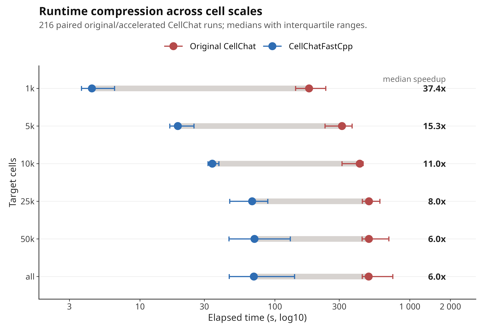

# CellChatAccelRcpp

CellChatAccelRcpp is an R/Rcpp acceleration layer for large-scale CellChat RNA workflows. It keeps the standard CellChat object interface and replaces selected computational bottlenecks with compiled routines for communication probability estimation, pathway aggregation, network aggregation and group-level expression summaries.

The package is designed for users who want to run many CellChat analyses at larger cell scales while preserving outputs that remain directly comparable with the original CellChat workflow.

## Key Results

In a paired benchmark across 12 real single-cell datasets, six target cell scales and three repeats, CellChatAccelRcpp completed 864 benchmark jobs without failed metric files.

| metric | result |
| --- | ---: |
| paired original/accelerated comparisons | 216 |
| overall median speedup | 11.4x |
| median original CellChat runtime | 426.6 s |
| median CellChatAccelRcpp runtime | 36.0 s |
| maximum absolute probability difference | 1.39e-16 |
| minimum probability Pearson correlation | 1.000 |

Median speedup by target cell scale:

| cells | median speedup |
| ---: | ---: |
| 1k | 37.4x |
| 5k | 15.3x |
| 10k | 11.0x |
| 25k | 8.0x |
| 50k | 6.0x |
| all available cells | 6.0x |



Full benchmark scripts, publication figures and summary tables are in [`benchmarks/cellchat_acceleration_2026`](benchmarks/cellchat_acceleration_2026); manuscript result tables are under `benchmarks/cellchat_acceleration_2026/results/tables/`. Application Note writing material and LaTeX sources are in [`paper`](paper).

## Installation

Install CellChat and then install this package from GitHub:

```r
install.packages("remotes")
remotes::install_github("jinworks/CellChat")
remotes::install_github("Blake-Deng/CellChatAccelRcpp")
```

For reproducible benchmark work, use the conda environment file in:

```text
benchmarks/cellchat_acceleration_2026/environment.yml
```

## Single Object Usage

```r
library(CellChat)
library(CellChatAccelRcpp)

cellchat <- CellChat::subsetData(cellchat)
cellchat <- CellChat::identifyOverExpressedGenes(cellchat)
cellchat <- CellChat::identifyOverExpressedInteractions(cellchat)

cellchat <- computeCommunProbAccelRcpp(cellchat, nboot = 100, seed.use = 1L)
cellchat <- CellChat::filterCommunication(cellchat, min.cells = 10)
cellchat <- computeCommunProbPathwayAccelRcpp(cellchat)
cellchat <- aggregateNetAccelRcpp(cellchat)
```

## Batch Usage

Run CellChatAccelRcpp on all Seurat `.rds` files in a directory:

```bash
Rscript scripts/run_cellchat_accel_batch.R \
  --input_dir /path/to/seurat_rds \
  --output_dir /path/to/cellchat_accel_results \
  --group_col openscpca_celltype_annotation \
  --pattern '\\.rds$' \
  --nboot 100 \
  --min_cells 10 \
  --species human
```

Before applying the package to a new dataset type or CellChat version, run:

```bash
Rscript scripts/check_equivalence_one.R \
  /path/to/one_sample_processed_seurat.rds \
  openscpca_celltype_annotation \
  5
```

## Scope

CellChatAccelRcpp currently targets:

- single-dataset CellChat objects
- sc/snRNA-seq RNA workflows
- `type = "triMean"`
- `population.size = FALSE`
- non-spatial CellChat workflows
- CellChat v1-style object/API

It does not currently validate spatial distance constraints, `population.size = TRUE`, alternative mean functions, merged CellChat objects or full CellChat v2 workflows. Run the equivalence script before using new settings at scale.

## Repository Layout

```text
R/                      R interface for accelerated CellChat steps
src/                    Rcpp implementations and registration
scripts/                batch and equivalence-check scripts
benchmarks/             reproducible benchmark summaries and figures
paper/                  Bioinformatics Application Note draft material
```

## Citation

Please cite the archived software release:

```text
Deng Z. CellChatAccelRcpp: scalable Rcpp acceleration of CellChat inference for large single-cell communication analyses.
DOI: https://doi.org/10.5281/zenodo.21186108
GitHub: https://github.com/Blake-Deng/CellChatAccelRcpp
```
